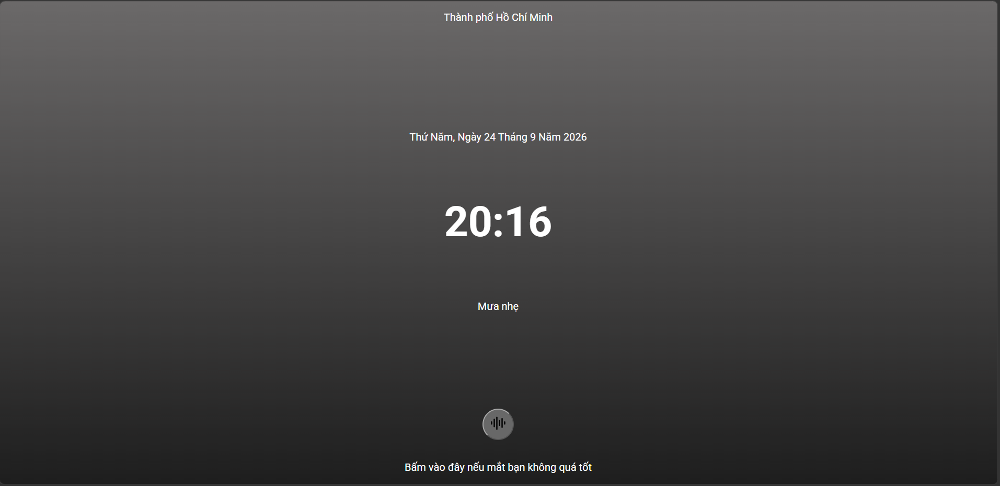
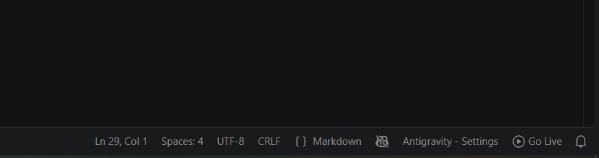

# Giới thiệu dự án Weather-Clock
## Tổng quan
Weather-Clock là một web hiển thị ngày hôm nay, giờ hiện tại, vị trí hiện tại và thời tiết hiện tại của người dùng

[Bấm vào đây để truy cập vào trang web](https://phucthg02394.github.io/Weather-Clock/)

## Video Demo
[Bấm vào đây để xem video demo](https://1drv.ms/v/c/45D6AD3AA5C3439C/IQAehQxcCcHSTqEGiMlbYZ_zAbosTjZ_yjzSqA626zbQKls?e=Ftu4yg)

## Ảnh chụp giao diện
<figure>
    
    <figcaption>Màn hình trang chủ</figcaption>
</figure>

## Cách cài dự án
Bước 1: Sử dụng một trong hai lệnh sau:
```bash
git clone git@github.com:phucthg02394/Weather-Clock.git
```
Hoặc 
```bash
git clone https://github.com/phucthg02394/Weather-Clock.git
```
Bước 2: Cài đặt Extension Live Server nếu chưa có


Bước 3: Vào thư mục gốc dự án và bấm Live Server
